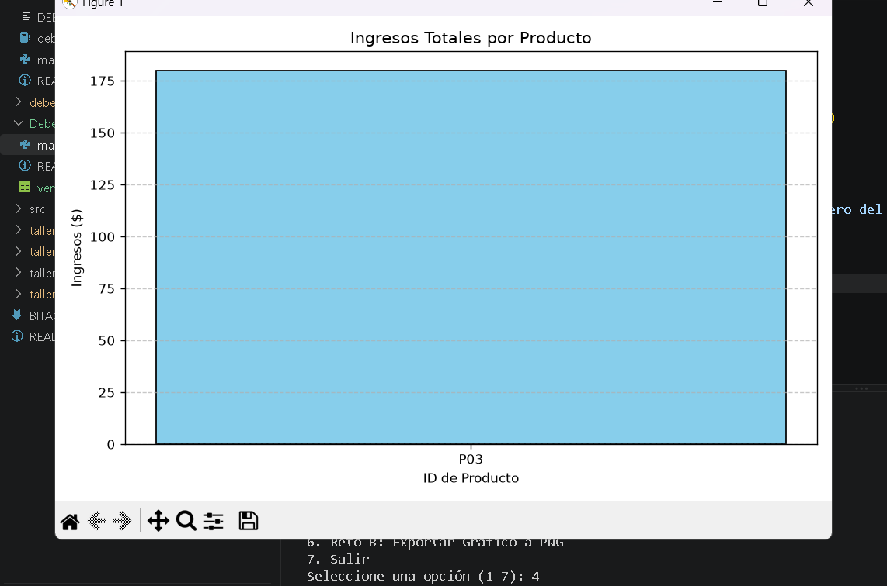
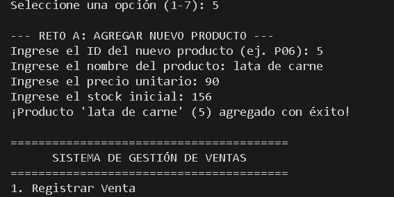
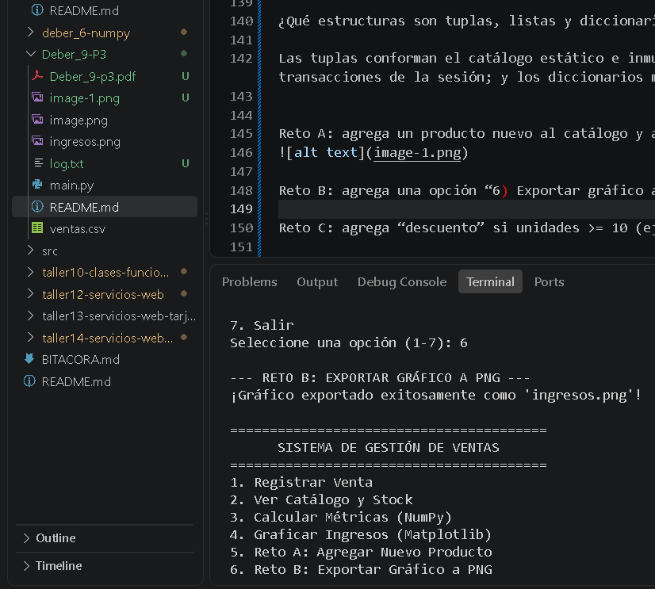

========================================
      SISTEMA DE GESTIÓN DE VENTAS
========================================
1. Registrar Venta
2. Ver Catálogo y Stock
3. Calcular Métricas (NumPy)
4. Graficar Ingresos (Matplotlib)
5. Reto A: Agregar Nuevo Producto
6. Reto B: Exportar Gráfico a PNG
7. Salir
Seleccione una opción (1-7): 1

--- REGISTRAR NUEVA VENTA ---
Ingrese el ID del producto (ej. P01): P03
Ingrese la cantidad a vender: 4
Venta registrada con éxito. Total a pagar: $180.00

========================================
      SISTEMA DE GESTIÓN DE VENTAS
========================================
1. Registrar Venta
2. Ver Catálogo y Stock
3. Calcular Métricas (NumPy)
4. Graficar Ingresos (Matplotlib)
5. Reto A: Agregar Nuevo Producto
6. Reto B: Exportar Gráfico a PNG
7. Salir
Seleccione una opción (1-7): 2

--- CATÁLOGO DE PRODUCTOS ---
ID: P01 | Producto: Laptop     | Precio: $800.00 | Stock: 15
ID: P02 | Producto: Mouse      | Precio: $ 25.00 | Stock: 60
ID: P03 | Producto: Teclado    | Precio: $ 45.00 | Stock: 36
ID: P04 | Producto: Monitor    | Precio: $200.00 | Stock: 20
ID: P05 | Producto: Audifonos  | Precio: $ 50.00 | Stock: 50

========================================
      SISTEMA DE GESTIÓN DE VENTAS
========================================
1. Registrar Venta
2. Ver Catálogo y Stock
3. Calcular Métricas (NumPy)
4. Graficar Ingresos (Matplotlib)
5. Reto A: Agregar Nuevo Producto
6. Reto B: Exportar Gráfico a PNG
7. Salir
Seleccione una opción (1-7): 3

--- MÉTRICAS CON NUMPY ---
Suma total de ingresos: $180.00
Media de ingresos por venta: $180.00
Desviación estándar de ingresos: $0.00
Ingreso promedio por unidad: $45.00

========================================
      SISTEMA DE GESTIÓN DE VENTAS
========================================
1. Registrar Venta
2. Ver Catálogo y Stock
3. Calcular Métricas (NumPy)
4. Graficar Ingresos (Matplotlib)
5. Reto A: Agregar Nuevo Producto
6. Reto B: Exportar Gráfico a PNG
7. Salir
Seleccione una opción (1-7): 4

--- GRÁFICA DE INGRESOS POR PRODUCTO ---

========================================
      SISTEMA DE GESTIÓN DE VENTAS
========================================
1. Registrar Venta
2. Ver Catálogo y Stock
3. Calcular Métricas (NumPy)
4. Graficar Ingresos (Matplotlib)
5. Reto A: Agregar Nuevo Producto
6. Reto B: Exportar Gráfico a PNG
7. Salir
Seleccione una opción (1-7): 4

--- GRÁFICA DE INGRESOS POR PRODUCTO ---

========================================
      SISTEMA DE GESTIÓN DE VENTAS
========================================
1. Registrar Venta
2. Ver Catálogo y Stock
3. Calcular Métricas (NumPy)
4. Graficar Ingresos (Matplotlib)
5. Reto A: Agregar Nuevo Producto
6. Reto B: Exportar Gráfico a PNG
7. Salir
Seleccione una opción (1-7): 5

--- RETO A: AGREGAR NUEVO PRODUCTO ---
Ingrese el ID del nuevo producto (ej. P06): P07
Ingrese el nombre del producto: jugo de mora
Ingrese el precio unitario: 12
Ingrese el stock inicial: 90
¡Producto 'jugo de mora' (P07) agregado con éxito!

========================================
      SISTEMA DE GESTIÓN DE VENTAS
========================================
1. Registrar Venta
2. Ver Catálogo y Stock
3. Calcular Métricas (NumPy)
4. Graficar Ingresos (Matplotlib)
5. Reto A: Agregar Nuevo Producto
6. Reto B: Exportar Gráfico a PNG
7. Salir
Seleccione una opción (1-7): 6

--- RETO B: EXPORTAR GRÁFICO A PNG ---
¡Gráfico exportado exitosamente como 'ingresos.png'!

========================================
      SISTEMA DE GESTIÓN DE VENTAS
========================================
1. Registrar Venta
2. Ver Catálogo y Stock
3. Calcular Métricas (NumPy)
4. Graficar Ingresos (Matplotlib)
5. Reto A: Agregar Nuevo Producto
6. Reto B: Exportar Gráfico a PNG
7. Salir
Seleccione una opción (1-7): 7
Guardando datos y saliendo del sistema...
¡Hasta luego!

¿Qué parte la hizo Pandas? ¿Qué parte NumPy?

Pandas gestiona la estructura tabular, la persistencia en el archivo CSV y la agrupación de datos mediante groupby. NumPy se encarga de los cálculos estadísticos eficientes de los ingresos (como la suma, la media y la desviación estándar).

¿Dónde usaste try/except y por qué?

Se implementó para prevenir cierres abruptos del programa ante imprevistos comunes: al leer un archivo que aún no existe, al validar que el usuario ingrese números correctos y no letras, al evitar divisiones por cero en las métricas, y al registrar errores en log.txt.

¿Qué estructuras son tuplas, listas y diccionarios en el código?

Las tuplas conforman el catálogo estático e inmutable de productos; las listas funcionan como el búfer temporal que almacena las transacciones de la sesión; y los diccionarios mapean los precios y stocks, además de estructurar individualmente cada venta registrada.

Reto A: agrega un producto nuevo al catálogo y actualiza precios/stock 

Reto B: agrega una opción “6) Exportar gráfico a PNG” usando plt.savefig("ingresos.png").

Reto C: agrega “descuento” si unidades >= 10 (ej: 5%) usando if.
